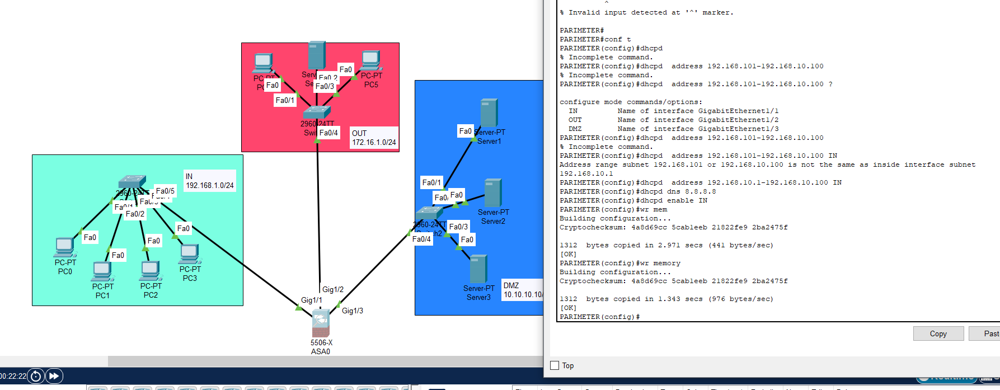

# 🔐 Cisco ASA Firewall with DHCP Server and SSH Remote Access

<div align="center">


**Advanced network security with automated IP distribution and secure remote management**

*Complete implementation of ASA firewall with integrated DHCP services and SSH access control*

[View Topology](#-network-topology) • [DHCP Setup](#-dhcp-configuration) • [SSH Guide](#-ssh-configuration)

</div>

---

## 📋 Project Overview

This project demonstrates a comprehensive Cisco ASA 5506-X firewall configuration that integrates three critical network services:

1. **Multi-Zone Security Architecture** - Three security zones (IN, OUT, DMZ) with hierarchical access control
2. **DHCP Server Integration** - Automated IP address distribution with configurable pools and exclusions
3. **SSH Remote Access** - Secure encrypted remote management with RSA key authentication

**Key Implementation:**
- ASA firewall with zone-based security (IN: Security 10, OUT: Security 0, DMZ: Security 100)
- DHCP server pools for automatic client configuration
- SSH version 2 with RSA 1024-bit encryption
- Password authentication and timeout policies
- NAT/PAT for internet connectivity
- Complete network segmentation and isolation

---

## 🖼️ Network Topology

<div align="center">
  
  <p><em>Three-zone network with ASA firewall, DHCP server, and SSH management</em></p>
</div>

### Network Architecture

**🟢 Internal Zone (IN)** - Security Level 10
- Network: 192.168.10.0/24
- DHCP Pool: 192.168.10.2 - 192.168.10.100
- Gateway: 192.168.10.1 (ASA Interface)
- DNS: 8.8.8.8
- 4 Client PCs receiving DHCP addresses
- Protected internal resources

**🔴 Outside Zone (OUT)** - Security Level 0
- Network: 172.16.1.0/24
- External interface: 172.16.1.1
- ISP connection simulation
- Internet gateway
- Untrusted zone

**🔵 DMZ Zone (DMZ)** - Security Level 100
- Network: 10.10.10.0/24
- DMZ Interface: 10.10.10.1
- Public-facing servers
- Semi-trusted zone for services
- Isolated from internal network

**🔐 Central Management**
- Cisco ASA0 (5506-X model)
- SSH enabled on IN interface (192.168.10.1)
- DHCP server enabled
- RSA key pair generated for SSH
- Three GigabitEthernet interfaces (Gig1/1, Gig1/2, Gig1/3)

---

## 💻 Configuration Screenshots

<div align="center">
  
  <p><em>Complete ASA configuration with DHCP pools and SSH setup</em></p>
</div>

<div align="center">
  
  <p><em>SSH connectivity test from internal network client</em></p>
</div>

<div align="center">
  
  <p><em>Successful DHCP IP address assignment to clients</em></p>
</div>

---

## 🛠️ Complete Configuration Guide

### Part 1: Initial ASA Setup

```cisco
ciscoasa> enable
ciscoasa# configure terminal
ciscoasa(config)# hostname PARIMETER
PARIMETER(config)# 

# Set enable password
PARIMETER(config)# enable password maliq
```

### Part 2: Interface Configuration

#### Configure Inside Interface (IN)
```cisco
PARIMETER(config)# interface gigabitEthernet 1/1
PARIMETER(config-if)# nameif IN
INFO: Security level for "IN" set to 0 by default.
PARIMETER(config-if)# security-level 10
PARIMETER(config-if)# ip address 192.168.10.1 255.255.255.0
PARIMETER(config-if)# no shutdown
PARIMETER(config-if)# exit
```

#### Configure Outside Interface (OUT)
```cisco
PARIMETER(config)# interface gigabitEthernet 1/2
PARIMETER(config-if)# nameif OUT
INFO: Security level for "OUT" set to 0 by default.
PARIMETER(config-if)# security-level 0
PARIMETER(config-if)# ip address 172.16.1.1 255.255.0.0
PARIMETER(config-if)# no shutdown
PARIMETER(config-if)# exit
```

#### Configure DMZ Interface
```cisco
PARIMETER(config)# interface gigabitEthernet 1/3
PARIMETER(config-if)# nameif DMZ
INFO: Security level for "DMZ" set to 0 by default.
PARIMETER(config-if)# security-level 100
PARIMETER(config-if)# ip address 10.10.10.1 255.0.0.0
PARIMETER(config-if)# no shutdown
PARIMETER(config-if)# exit
```

---

## 📡 DHCP Configuration

### Step 1: Configure DHCP Pool

```cisco
PARIMETER(config)# dhcpd address 192.168.10.1-192.168.10.100 IN
% Incomplete command.

# Correct syntax - define DHCP range
PARIMETER(config)# dhcpd address 192.168.10.2-192.168.10.100 IN

# Set DNS servers for DHCP clients
PARIMETER(config)# dhcpd dns 8.8.8.8
PARIMETER(config)# dhcpd option 3 ip 192.168.10.1

# Enable DHCP server on IN interface
PARIMETER(config)# dhcpd enable IN
```

### Step 2: Verify DHCP Configuration

```cisco
PARIMETER# show dhcpd
Interface IN
  DHCP Server: Enabled
  Address pool: 192.168.10.2-192.168.10.100
  DNS: 8.8.8.8
  Default Router: 192.168.10.1
  Lease: 86400 seconds (1 day)
```

### Step 3: View DHCP Bindings

```cisco
PARIMETER# show dhcpd binding
IP address       Client Identifier    Lease expiration        Type
192.168.10.2     01c0.1234.5678       86400 seconds           Automatic
192.168.10.3     01c0.1234.5679       86400 seconds           Automatic
```

### DHCP Configuration Breakdown

| Parameter | Value | Description |
|-----------|-------|-------------|
| **DHCP Pool Range** | 192.168.10.2 - 192.168.10.100 | Available IP addresses for clients |
| **Default Gateway** | 192.168.10.1 | ASA inside interface (DHCP Option 3) |
| **DNS Server** | 8.8.8.8 | Google Public DNS |
| **Lease Time** | 86400 seconds (1 day) | IP address lease duration |
| **Network** | 192.168.10.0/24 | Internal network subnet |
| **Interface** | IN (GigabitEthernet 1/1) | DHCP enabled interface |

---

## 🔐 SSH Configuration

### Step 1: Generate RSA Key Pair

```cisco
PARIMETER(config)# crypto key generate rsa modulus 1024
WARNING: You have a RSA keypair already defined named <Default-RSA-Key>.

Do you really want to replace them? [yes/no]: yes
Keypair generation process begin. Please wait...
```

### Step 2: Configure SSH Access

```cisco
# Enable SSH on IN interface with subnet
PARIMETER(config)# ssh 192.168.10.0 255.255.255.0 IN

# Set SSH timeout (in minutes)
PARIMETER(config)# ssh timeout 3

# Optional: Set telnet timeout
PARIMETER(config)# telnet timeout 3
Telnet timeout value must be in the range of 1 to 1440 minutes.

# Configure SSH authentication method
PARIMETER(config)# aaa authentication ssh console LOCAL
```

### Step 3: Create User Account for SSH

```cisco
PARIMETER(config)# username MAL password maliq privilege 15
PARIMETER(config)# username admin password cisco privilege 15
```

### Step 4: Verify SSH Configuration

```cisco
PARIMETER# show ssh
Timeout: 3 minutes
Version: v2 only

SSH allowed from:
  192.168.10.0 255.255.255.0 on interface IN

PARIMETER# show crypto key mypubkey rsa
Key pair was generated at: 09:08:24 UTC Dec 1 2025
Key name: <Default-RSA-Key>
Usage: General Purpose Key
Modulus Size (bits): 1024
```

---

## 🧪 Testing SSH Access

### From Windows Command Prompt

```cmd
C:\>ssh -l MAL 192.168.10.1
Password:

PARIMETER>en
Password:
PARIMETER#ping 192.168.10.2

Type escape sequence to abort.
Sending 5, 100-byte ICMP Echos to 192.168.10.2, timeout is 2 seconds:
!!!!!
Success rate is 80 percent (4/5), round-trip min/avg/max = 0/5/11 ms

PARIMETER#
```

### SSH Connection Process

1. **Initiate SSH connection**: `ssh -l username IP_address`
2. **Enter password**: Authenticate with configured password
3. **Access user EXEC mode**: Limited command access
4. **Enter privileged EXEC mode**: `enable` command + enable password
5. **Full management access**: Complete ASA configuration access

### Common SSH Commands

```cisco
# View active SSH sessions
PARIMETER# show ssh sessions

# Disconnect SSH session
PARIMETER# ssh disconnect session-id

# Test SSH from client
C:\>ssh -l MAL 192.168.10.1

# SSH with verbose output (troubleshooting)
C:\>ssh -v -l MAL 192.168.10.1
```

---

## 🔧 NAT Configuration

### Configure PAT for Internal Network

```cisco
# Create network object for internal network
PARIMETER(config)# object network IN-NET
PARIMETER(config-network-object)# subnet 192.168.10.0 255.255.255.0
PARIMETER(config-network-object)# nat (IN,OUT) dynamic interface
PARIMETER(config-network-object)# exit

# Verify NAT configuration
PARIMETER# show nat
```

---

## 📊 Complete Network Specifications

### IP Addressing Scheme

| Zone | Interface | IP Address | Subnet Mask | Network | Security Level |
|------|-----------|------------|-------------|---------|----------------|
| **IN** | Gig1/1 | 192.168.10.1 | 255.255.255.0 | 192.168.10.0/24 | 10 |
| **OUT** | Gig1/2 | 172.16.1.1 | 255.255.0.0 | 172.16.0.0/16 | 0 |
| **DMZ** | Gig1/3 | 10.10.10.1 | 255.0.0.0 | 10.0.0.0/8 | 100 |

### DHCP Server Settings

| Parameter | Configuration |
|-----------|--------------|
| **Server Status** | Enabled on IN interface |
| **IP Pool Start** | 192.168.10.2 |
| **IP Pool End** | 192.168.10.100 |
| **Excluded Range** | 192.168.10.1 (gateway) |
| **Default Gateway** | 192.168.10.1 |
| **DNS Server** | 8.8.8.8 |
| **Lease Duration** | 86400 seconds (24 hours) |
| **Total Available IPs** | 99 addresses |

### SSH Server Settings

| Parameter | Configuration |
|-----------|--------------|
| **SSH Version** | Version 2 only (secure) |
| **RSA Key Size** | 1024 bits |
| **Timeout** | 3 minutes |
| **Allowed Network** | 192.168.10.0/24 |
| **Interface** | IN (GigabitEthernet 1/1) |
| **Authentication** | LOCAL (username/password) |
| **Encryption** | AES, 3DES |

---

## 🎯 Key Features Implemented

✅ **Multi-Zone Security** - Three zones with hierarchical security levels  
📡 **Automated IP Distribution** - DHCP server for dynamic addressing  
🔐 **Secure Remote Access** - SSH v2 with RSA encryption  
🛡️ **Stateful Firewall** - Connection tracking and inspection  
🌐 **NAT/PAT** - Internal network internet access  
📋 **User Management** - Local authentication database  
⏱️ **Session Timeouts** - Automatic disconnection for security  
🔒 **Password Protection** - Multiple authentication layers  
📊 **Lease Management** - DHCP binding and renewal

---

## 🔍 Verification Commands

### Verify Interfaces

```cisco
PARIMETER# show interface ip brief
Interface                  IP-Address      OK? Method Status                Protocol
GigabitEthernet1/1         192.168.10.1    YES manual up                    up
GigabitEthernet1/2         172.16.1.1      YES manual up                    up
GigabitEthernet1/3         10.10.10.1      YES manual up                    up
```

### Verify DHCP Server

```cisco
PARIMETER# show dhcpd
PARIMETER# show dhcpd binding
PARIMETER# show dhcpd statistics
```

### Verify SSH Configuration

```cisco
PARIMETER# show ssh
PARIMETER# show ssh sessions
PARIMETER# show crypto key mypubkey rsa
PARIMETER# show running-config ssh
```

### Verify Security Levels

```cisco
PARIMETER# show nameif
Interface                Name                     Security
GigabitEthernet1/1       IN                       10
GigabitEthernet1/2       OUT                      0
GigabitEthernet1/3       DMZ                      100
```

### Test Connectivity from ASA

```cisco
PARIMETER# ping 192.168.10.2
Type escape sequence to abort.
Sending 5, 100-byte ICMP Echos to 192.168.10.2, timeout is 2 seconds:
!!!!!
Success rate is 80 percent (4/5), round-trip min/avg/max = 0/5/11 ms
```

---

## 🚨 Testing Scenarios

### Scenario 1: DHCP IP Assignment

```
1. Connect PC to IN zone switch
2. Configure PC for DHCP: ip address dhcp
3. Verify IP assignment: ipconfig
4. Expected result: IP from 192.168.10.2-100 range
5. Verify gateway: 192.168.10.1
6. Verify DNS: 8.8.8.8
```

**Expected Output:**
```
PC> ip dhcp
DDORA IP 192.168.10.2/24

PC> ipconfig
IP Address......................: 192.168.10.2
Subnet Mask.....................: 255.255.255.0
Default Gateway.................: 192.168.10.1
DNS Server......................: 8.8.8.8
```

### Scenario 2: SSH Remote Access

```
1. From PC in IN zone (192.168.10.2)
2. SSH to ASA: ssh -l MAL 192.168.10.1
3. Enter password: maliq
4. Access user mode
5. Enter enable mode: enable
6. Enter enable password: maliq
7. Full access to ASA
```

**Expected Output:**
```
C:\>ssh -l MAL 192.168.10.1
Password:

PARIMETER>enable
Password:
PARIMETER#
```

### Scenario 3: Internet Connectivity via NAT

```
1. PC receives DHCP address
2. Default gateway set to 192.168.10.1
3. Test connectivity: ping 8.8.8.8
4. NAT translates internal IP to OUT interface IP
5. Expected result: Successful ping response
```

### Scenario 4: DHCP Lease Renewal

```
1. PC obtains DHCP address
2. Wait for lease renewal (typically 50% of lease time)
3. Check DHCP bindings on ASA
4. Verify lease is renewed automatically
5. No connectivity interruption
```

---

## 🐛 Troubleshooting Guide

### Issue 1: DHCP Not Working

**Symptoms:** Clients not receiving IP addresses

**Diagnosis:**
```cisco
PARIMETER# show dhcpd
PARIMETER# show dhcpd binding
PARIMETER# show interface gigabitEthernet 1/1
```

**Solution:**
```cisco
# Ensure DHCP is enabled
PARIMETER(config)# dhcpd enable IN

# Verify address pool
PARIMETER(config)# dhcpd address 192.168.10.2-192.168.10.100 IN

# Check interface is up
PARIMETER(config)# interface gigabitEthernet 1/1
PARIMETER(config-if)# no shutdown
```

### Issue 2: SSH Connection Refused

**Symptoms:** Cannot connect via SSH

**Diagnosis:**
```cisco
PARIMETER# show ssh
PARIMETER# show crypto key mypubkey rsa
PARIMETER# show running-config | include ssh
```

**Solution:**
```cisco
# Generate RSA key if missing
PARIMETER(config)# crypto key generate rsa modulus 1024

# Enable SSH on correct interface
PARIMETER(config)# ssh 192.168.10.0 255.255.255.0 IN

# Create user account
PARIMETER(config)# username MAL password maliq privilege 15

# Verify SSH version
PARIMETER(config)# ssh version 2
```

### Issue 3: SSH Timeout Too Short

**Symptoms:** SSH sessions disconnect frequently

**Solution:**
```cisco
# Increase SSH timeout (in minutes)
PARIMETER(config)# ssh timeout 30

# Verify setting
PARIMETER# show ssh
```

### Issue 4: DHCP Pool Exhausted

**Symptoms:** New clients cannot get IP addresses

**Diagnosis:**
```cisco
PARIMETER# show dhcpd binding
PARIMETER# show dhcpd statistics
```

**Solution:**
```cisco
# Expand DHCP pool range
PARIMETER(config)# dhcpd address 192.168.10.2-192.168.10.200 IN

# Clear old bindings if necessary
PARIMETER# clear dhcpd binding

# Reduce lease time for faster IP reuse
PARIMETER(config)# dhcpd lease 43200
```

### Issue 5: Cannot Access Internet from DHCP Clients

**Symptoms:** DHCP works, but no internet access

**Diagnosis:**
```cisco
PARIMETER# show nat
PARIMETER# show route
PARIMETER# ping 8.8.8.8
```

**Solution:**
```cisco
# Configure NAT for internal network
PARIMETER(config)# object network IN-NET
PARIMETER(config-network-object)# subnet 192.168.10.0 255.255.255.0
PARIMETER(config-network-object)# nat (IN,OUT) dynamic interface

# Verify default route
PARIMETER(config)# route OUT 0.0.0.0 0.0.0.0 172.16.1.254

# Check DNS is configured in DHCP
PARIMETER(config)# dhcpd dns 8.8.8.8
```

---

## 🔒 Security Best Practices

### 1. SSH Hardening

```cisco
# Use SSH version 2 only
PARIMETER(config)# ssh version 2

# Strong RSA key size
PARIMETER(config)# crypto key generate rsa modulus 2048

# Limit SSH access to specific networks
PARIMETER(config)# ssh 192.168.10.0 255.255.255.0 IN

# Set reasonable timeout
PARIMETER(config)# ssh timeout 5

# Use strong passwords
PARIMETER(config)# username admin password Str0ngP@ssw0rd! privilege 15
```

### 2. DHCP Security

```cisco
# Limit DHCP pool to necessary range
PARIMETER(config)# dhcpd address 192.168.10.2-192.168.10.100 IN

# Set appropriate lease time
PARIMETER(config)# dhcpd lease 86400

# Reserve static IPs for critical devices
PARIMETER(config)# dhcpd address 192.168.10.2-192.168.10.20 IN

# Monitor DHCP bindings regularly
PARIMETER# show dhcpd binding
```

### 3. Access Control

```cisco
# Create different privilege levels
PARIMETER(config)# username admin password cisco123 privilege 15
PARIMETER(config)# username operator password cisco123 privilege 5

# Enable AAA
PARIMETER(config)# aaa authentication ssh console LOCAL

# Log security events
PARIMETER(config)# logging enable
PARIMETER(config)# logging host IN 192.168.10.100
```

### 4. Password Policies

```cisco
# Set enable password
PARIMETER(config)# enable password maliq

# Use encrypted passwords
PARIMETER(config)# password encryption aes

# Password minimum length (if supported)
PARIMETER(config)# password-policy minimum-length 8
```

---

## 📁 Project Files

```
asa-dhcp-ssh-config/
├── assets/
│   ├── topology-full.png        # Complete network topology
│   ├── cli-config.png          # ASA configuration screenshot
│   ├── ssh-access.png          # SSH connectivity test
│   └── dhcp-test.png           # DHCP IP assignment
├── configs/
│   ├── asa-startup.cfg         # Initial configuration
│   ├── asa-dhcp.cfg            # DHCP configuration
│   ├── asa-ssh.cfg             # SSH configuration
│   └── asa-complete.cfg        # Full configuration
├── packet-tracer/
│   └── asa-dhcp-ssh.pkt        # Packet Tracer project file
├── docs/
│   ├── DHCP-Guide.md           # DHCP setup documentation
│   └── SSH-Guide.md            # SSH setup documentation
└── README.md
```

---

## 🎓 Learning Objectives

After completing this project, you will master:

- ✅ Cisco ASA multi-zone firewall configuration
- ✅ DHCP server setup and management on ASA
- ✅ SSH secure remote access configuration
- ✅ RSA key pair generation and management
- ✅ User authentication and privilege levels
- ✅ NAT/PAT for internet connectivity
- ✅ Security zone implementation
- ✅ DHCP pool management and troubleshooting
- ✅ SSH session management
- ✅ Network address planning
- ✅ Access control and security policies
- ✅ Firewall verification and testing

---

## 🚀 Advanced Configuration Ideas

<details>
<summary><b>🔐 DHCP Reservation</b></summary>

Reserve specific IP addresses for critical devices:
```cisco
PARIMETER(config)# dhcpd address 192.168.10.10 IN client-id 01aa.bbcc.ddee.ff
```
</details>

<details>
<summary><b>📊 DHCP Option Configuration</b></summary>

Add custom DHCP options:
```cisco
# NTP server
PARIMETER(config)# dhcpd option 42 ip 192.168.10.254

# Domain name
PARIMETER(config)# dhcpd domain example.com
```
</details>

<details>
<summary><b>🔑 SSH Key-Based Authentication</b></summary>

Configure public key authentication for enhanced security:
```cisco
PARIMETER(config)# crypto key import rsa
```
</details>

<details>
<summary><b>📝 SSH Access Logging</b></summary>

Enable detailed SSH logging:
```cisco
PARIMETER(config)# logging enable
PARIMETER(config)# logging trap debugging
PARIMETER(config)# logging host IN 192.168.10.100
```
</details>

<details>
<summary><b>🌐 Multiple DHCP Pools</b></summary>

Create separate DHCP pools for different VLANs:
```cisco
PARIMETER(config)# dhcpd address 192.168.20.2-192.168.20.100 VLAN20
PARIMETER(config)# dhcpd enable VLAN20
```
</details>

---

## 📚 Additional Resources

- [Cisco ASA DHCP Server Configuration](https://www.cisco.com/c/en/us/support/docs/security/asa-5500-x-series-next-generation-firewalls/100290-asa-dhcp-config.html)
- [Cisco ASA SSH Configuration Guide](https://www.cisco.com/c/en/us/support/docs/security/asa-5500-x-series-next-generation-firewalls/119143-configure-asa-00.html)
- [ASA Command Reference](https://www.cisco.com/c/en/us/td/docs/security/asa/asa-command-reference/A-H/cmdref1.html)
- [DHCP Options Reference](https://www.iana.org/assignments/bootp-dhcp-parameters/bootp-dhcp-parameters.xhtml)

---

## 🤝 Contributing

Contributions welcome! To contribute:

1. Fork the repository
2. Create feature branch (`git checkout -b feature/DHCPEnhancement`)
3. Commit changes (`git commit -m 'Add DHCP snooping feature'`)
4. Push to branch (`git push origin feature/DHCPEnhancement`)
5. Open Pull Request

---

## 📄 License

This project is licensed under the MIT License - free to use for educational purposes.

---

## 👨‍💻 Author

**renaiy0**

📧 Questions? Open an issue!  
⭐ Found this helpful? Star the repo!  
🔗 Share with network engineers!

---

<div align="center">

**Securing Networks with Automation** 🔐

*DHCP + SSH + Firewall = Complete Network Security*

**[⬆ Back to Top](#-cisco-asa-firewall-with-dhcp-server-and-ssh-remote-access)**

</div>
